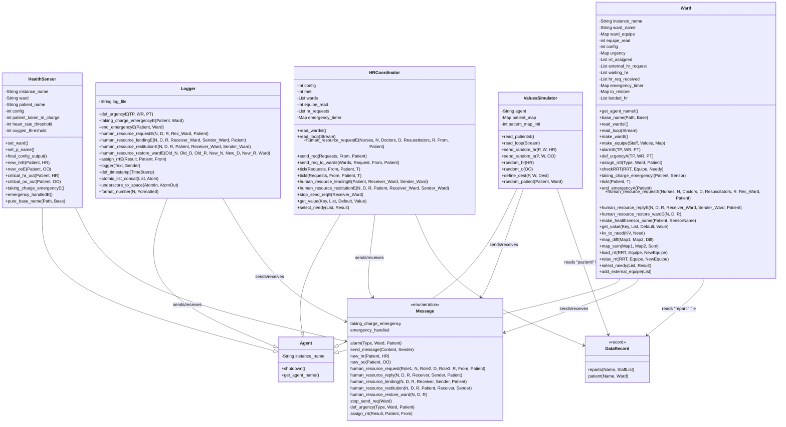
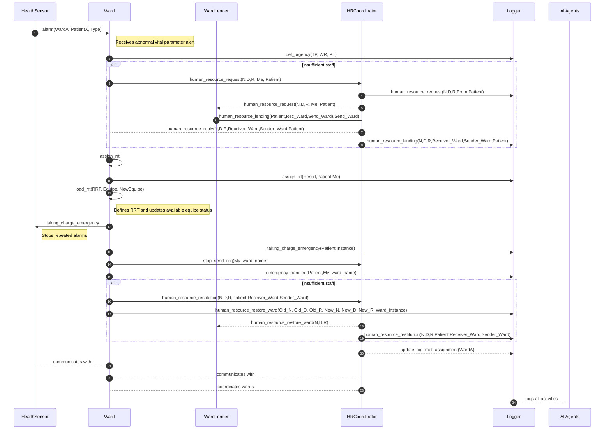

# Multi-Agent System for Emergency Handling and Resources Dispatching in a smart-hospital

## Objective
Design and implement a multi-agent system in the DALI language for the detection and coordinated management of emergency as Cardiac Arrest, Acute Respiratory Distress and Severe Cardiovascular Instability.   

---

## Phase 1: Design according to the GAIA Methodology

### 1.1 Roles

| Role         | Main Responsibilities                                     |
|--------------|-----------------------------------------------------------|
| **HealthSensor**   | Detects out of range vital parameters.    |
| **Ward** | Manages the internal equipe defining the Rapid Rescue Team (RRT) and alerts the HRCoordinator in order to achieve extra HR. |
| **HRCoordinator**| Manages requests of human resources through the wards.                           |
| **Logger**   | Records all events, actions, and system status.           |
| **ValuesSimulator**   | Sends randomic vital signs to the HealthSensors|

### 1.1.1 Role Schemas

---

#### **Role Schema: HealthSensor**

- **Description:**  
  Detects out-of-range vital parameters ( systolic pressure and oxygen saturation) from the monitored patient.  
  When an anomaly is detected, it triggers an alarm to the Ward.  
  Once the Ward takes charge of the event, the HealthSensor stops generating repeated alarms.

- **Protocols and Activities:**  
  `configuration_phase`,`critical_*_out(Patient,*)`.

- **Permissions:**
  - **Reads:** `new_*(Patient,*)`,`taking_charge_emergency`,`emergency_handled`
  - **Generates:** `alarm(Values,Ward,Patient)`

- **Responsibilities:**
  - **Liveness:**  
    `(new_*(Value) → critical_*_out(Patient,*) → alarm(Ward,Patient,Values)`
  - **Safety:**  
    Alarms must be generated only if threshold limits are exceeded.  
    Avoid redundant alarms until `taking_charge_emergency` is received from the Ward, restart to monitor patients after receiving `emergency_handled`.

---

#### **Role Schema: Ward**

- **Description:**  
  Coordinates emergency handling within the ward.  
  Receives alarms from HealthSensor agents, defines the Rapid Rescue Team (RRT), updates local equipe availability, and interacts with the HRCoordinator to request or lend human resources.  
  It ensures that emergencies are promptly taken in charge and properly logged once resolved.

- **Protocols and Activities:**  
  `assign_rrt`, `configuration_phase`, `checkRRT(RRT, Equipe, Needy)`,  
  `get_value(Chiave, ListaCoppie, Default, Valore)`, `make_healthsensor_name(Patient, SensorName)`, `emergency_handled(Ward,Patient)`, `taking_charge_emergency`,`map_diff`,`map_sum`,`load_rrt`,`select_needy`, `add_external_equipe`.

- **Permissions:**
  - **Reads:** `alarmE(TP, WR, PT) `, `human_resource_reply(N,D,R,Receiver_Ward,Sender_Ward,Patient)`, `human_resource_request(N,D,R,Rec_Ward,Patient)`, `human_resource_restore_ward(N,D,R)`
  - **Changes:** `available_equipe(Ward)`
  - **Generates:** `human_resource_request(N,D,,R, Me, Patient)`,  `taking_charge_emergency`,  
    `def_urgency(TP, WR, PT)`, `emergency_handled(Ward,Patient)`,`assign_rrt(Result,Patient,Me)` `human_resource_restore_ward(Old_N, Old_D, Old_R, New_N, New_D, New_R, Ward_instance)`, `human_resource_lending(Patient,Rec_Ward,Send_Ward)`

- **Responsibilities:**
  - **Liveness:**  
    `(alarm  → def_urgency → assign_rrt → taking_charge_emergency → (emergency_handled(Ward,Patient)  ∧ (emergency_handled(Ward,Patient) ∨ (human_resource_restore_ward(Old_N, Old_D, Old_R, New_N, New_D, New_R, Ward_instance))) )`
  - **Safety:**  
    Must never execute `assign_rrt` if  `available_equipe(Ward)` is insufficient.  
    All alarms must trigger a response action within a defined time frame.

---

#### **Role Schema: HRCoordinator**

- **Description:**  
  Central coordinating agent that manages hospital-wide human resources requests.  
  Receives `human_resource_request(Nurses,N,Doctors,D,Resuscitators,R, From, Patient)` ,`human_resource_lending(Patient,Receiver_Ward,Sender_Ward)`, `stop_send_req(Receiver_Ward)` or `human_resource_restitution(N,D,R,Patient,Receiver_Ward,Sender_Ward)` messages from Wards, checks availability, and performs either `send_req(Requests, From, Patient)`, forwards ,`human_resource_restitution(N,D,R,Patient,Receiver_Ward,Sender_Ward)` to the lender ward.  
  Updates the Logger with each assignment to ensure full traceability.

- **Protocols and Activities:**  
  `configuration_phase`, `send_req(Requests, From, Patient)`
- **Permissions:**
  - **Reads:** `human_resource_request(Nurses,N,Doctors,D,Resuscitators,R, From, Patient)` ,`human_resource_lending(Patient,Receiver_Ward,Sender_Ward)`, `stop_send_req(Receiver_Ward)` or `human_resource_restitution(N,D,R,Patient,Receiver_Ward,Sender_Ward)`
  - **Changes:** `sended_req`,`emergency_timer`,`pending_req`,`pending_req_timer`,`hr_requests`,`to_send`
  - **Generates:** `human_resource_reply(N,D,R,Receiver_Ward,Sender_Ward,Patient)`, `human_resource_request(N,D,R,From,Patient)`,  
    `human_resource_lending(N,D,R,Receiver_Ward,Sender_Ward,Patient)`, `human_resource_restore_ward(N,D,R)`,`human_resource_restitution(N,D,R,Patient,Receiver_Ward,Sender_Ward)`

- **Responsibilities:**
  - **Liveness:**  
    `(human_resource_request(N,D,R, From, Patient) → send_req(Requests, From, Patient) → human_resource_lending(Patient,Receiver_Ward,Sender_Ward) → human_resource_reply(N,D,R,Receiver_Ward,Sender_Ward,Patient))  (human_resource_restitution(N,D,R,Patient,Receiver_Ward,Sender_Ward) → , human_resource_restore_ward(N,D,R)`
  - **Safety:**  
    Must avoid assigning already engaged HRs or unavailable personnel.  
    Guarantee coherence between `human_resource_lending` and global staff availability across wards.  

---

#### **Role Schema: Logger**

- **Description:**  
  Centralized logging agent responsible for recording every relevant event, action, and assignment within the system.  
  Maintains persistence of logs for traceability, analytics, and post-event auditing.  
  Receives updates from all other agents and stores them in a structured format.

- **Protocols and Activities:**  
  `atomic_list_concat`, `underscore_to_space`, `logger`, `format_number`, `def_timestamp`.

- **Permissions:**
  - **Reads:** incoming event notifications from `Ward`, and `HRCoordinator`
  - **Changes:** internal log.txt file 
  - **Generates:** persistent and timestamped log entries for each received event in log.txt file

- **Responsibilities:**
  - **Liveness:**  
    `(receive_event → define output → update log.txt`
  - **Safety:**  
    Guarantee one log entry per unique timestamp.  
    Maintain temporal order of logged events for accurate reconstruction.

---

### 1.2 Virtual Organization

- **Name**: `EmergencyManagementSystem`
- **Goals**:
  - Minimize the latency time between the emergency accouring and the covering of the emergency.
  - Ensure the emergency covering and a smart dispatching of human resorces.
- **Roles and Interactions**:
  - `HealthSensor → Ward`: sends alarm messages.
  - `Ward → HRCoordinator`: sends and lends Human Resources requests.
  - `HRCoordinator → Ward`: assign Human Resources an emergency, asks for Human Resources. 
  - `All → Logger`: record of all relevant events and actions: Human Resources requests, emergency covering.

### 1.3 Event Table

#### HealthSensor

| Event                | Type     | Source      |
|----------------------|----------|-------------|
| `new_*(Patient,Value)`          | external | ValuesSimulator |
| `taking_charge_emergency`   | external | Ward|
| `emergency_handled`   | external | Ward|
| `get_agent_name`   | Internal | HealthSensor|
| `set_ward`   | Internal | HealthSensor|
| `final_config_output`   | Internal | HealthSensor|

#### Ward

| Event                | Type     | Source      |
|----------------------|----------|-------------|
| `alarm(Type,Val,Patient)`        | external | HealthSensor      |
| `human_resource_reply(human_res_map,Ward)`   | external | HRCoordinator      |
| `human_resource_request(human_res_map,Ward)`   | external | HRCoordinator      |
| `human_resource_restore_ward(N,D,R)`   | external | HRCoordinator      |
| `assign_rrt`  |internal  |Ward  |
| `taking_charge_emergency`  |internal  |Ward  |
| `met_assignment`   | external | HRCoordinator       |

#### HRCoordinator

| Event                | Type     | Source |
|----------------------|----------|-------------|
| `human_resource_request(N,D,R, From, Patient)`|external  |Ward  |
| `human_resource_lending(Patient,Receiver_Ward,Sender_Ward)`|external  |Ward  |
| `human_resource_restitution(N,D,R,Patient,Receiver_Ward,Sender_Ward)` | external | Ward |
| `sending_tick` | internal | HRCoordinator |
| `timeout_tick` | internal | HRCoordinator |
| `send_req_to_wards`|internal  |HRCoordinator  |
| `read_wards`|internal  |HRCoordinator  |
| `stop_send_req(Receiver_Ward)`|external  |Ward  |

#### Logger

| Event                | Type     | Source |
|----------------------|----------|-------------|
| `def_urgency(TP, WR, PT)`|external|Ward|
| `taking_charge_emergency(Patient,Ward)`|external|Ward|
| `human_resource_request(N,D,R,Rec_Ward,Patient)`|external|HRCoordinator|
| `human_resource_lending(N,D,R,Receiver_Ward,Sender_Ward,Patient)`|external|HRCoordinator|
| `human_resource_restitution(N,D,R,Patient,Receiver_Ward,Sender_Ward)`|external|HRCoordinator|
| `emergency_handled(Ward,Patient)`|external|Ward|
| `assign_rrt(Result,Patient,From)`|external|Ward|
| `human_resource_restore_wardE(Old_N, Old_D, Old_R, New_N, New_D, New_R, Ward)`|external|Ward|

### 1.4 Action Table

#### HealthSensor

| Action                      | Description                                 |
|-----------------------------|---------------------------------------------|
| `critical_*_out(Patient,*)`   |Checks if values received are critical |
| `alarm(Ward,Patient,Type)` | After the detection of a new emergency the Logger will be updated  |

#### Ward

| Action                      | Description                                 |
|-----------------------------|---------------------------------------------|
| `assign_rrt`   | Define the rapid rescue team (RRT) in order to handle the emergency aid  |
| `add_external_equipe(List)`   | After receiving extra HR incrase the available equipe|
| `select_needy(List, Result)`   | When HR are insufficient selects which ward needs|
| `load_rrt`   | Decrease the available equipe |
| `end_emergency(Patient)`   | When an emergency has been handled rrt is relesed and and if there id extra HR returns it|
| `checkRRT(RRT, Equipe, Needy)`   |  Check if there is enough HR available|
| `def_urgency(TP,WR, PT)` | Define a new emergency|

#### HRCoordinator

| Action                      | Description                                 |
|-----------------------------|---------------------------------------------|
| `send_req(Requests, From, Patient)`   | Sends HR requests to the wards |

#### Logger

| Action                      | Description                                 |
|-----------------------------|---------------------------------------------|
| `logger(Text, Sender)`   | Add new emergency to the log file|
| `format_number(N, Formatted)`   | Add new MET request the the log file|
| `def_timestamp(TimeStamp)`   | Specify the the ward where the MET has been assigned|
| `atomic_list_concat(List, Atom)`   | Fix an emergency as 'handled'|

### 2 Acquaitance Model

| Source Agent  | Target Agent  | Communication Type | Purpose                             |
| ------------- | ------------- | ------------------ | ----------------------------------- |
| HealthSensor   | Ward     | Direct             | Send alarms                         |
| Ward    | HRCoordinator | Direct             | Request/ lends or human resources      |
| HRCoordinator | Ward    | Direct             | Send/Requests human resource  |
| All Agents    | LoggerAgent   | Direct          | Update event logs                   |

#### Organizational Rules

  #### Scenario Example: Cardiac Arrest 

  1. HealthSensor detects abnormal HR → triggers alarm(WardA, PatientX, Type).

  2. Ward receives the alarm and performs assign_rrt.

  3. If staff is insufficient, Ward performs requests for extra HR to HRCoordinator.

  4. HRCoordinator receives the HR request, asks to other Wards extra HR and assign them.

  5. All actions and assignments are sent to Logger .

  6. When the emergency is resolved, Ward executes end_emergency(PatientX), if Ward used extra HR returns them to the HRCoordinator.

#### Trheshold Parameters

| Parameter         | Low Threshold | High Threshold |
| ----------------- | ------------- | -------------- |
| Heart Rate        | < 40 bpm      | > 130 bpm      |
| O₂ Saturation     | < 90%         | —              |

---
### 3 configuration files

The agents Ward and HealthSensor have an instance name with a defined pattern:
- `HealthSensor`: `HealthSensor_<wardname>_<patientID>` (Note that the patientID must be univocal)
- `Ward`: `Ward_<wardname>` (Note that <wardname> must be univocal)

The configuration phase in every agent allow to define dynamically the system dimension through the reparti and pazienti file:
- `pazienti`: contains propositions with the pattern -> `patient(Patient_name,Patient_ward)`.
- `reparti`: contains proposition with the pattern -> `ward(patient_ward, list_number_equipe)` equipe in this order-> `'nurses','doctors','resuscitators'`

In the configuration phase of every instace of `Ward` is read its own instance name, the equipe of its own ward defined in `reparti`.
In the configuration phase of every instace of `HealthSensor` is read its own instance name which allow to the instance define its ward through reading the pazienti file.
At the end the instance of HRCoordinator reads all the defined wards.

### 4 Screenshoots
- ValuesSimulator:
  
- HRCoordinator:
  
- HealthSimulator:
  
- Logger:
  
- Ward
  
